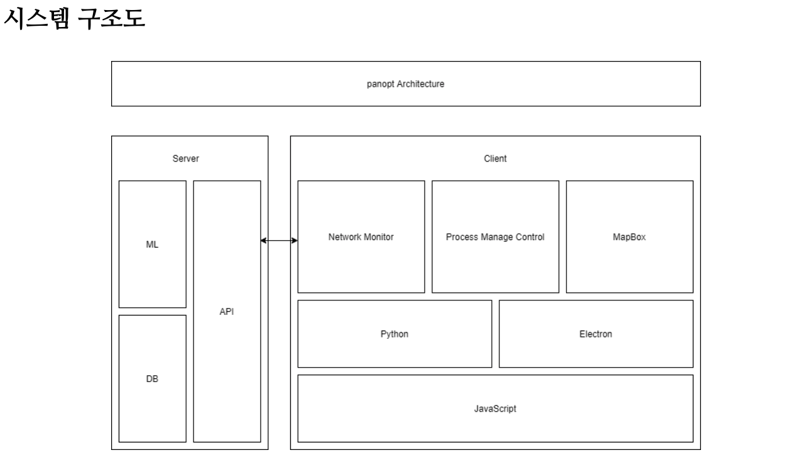
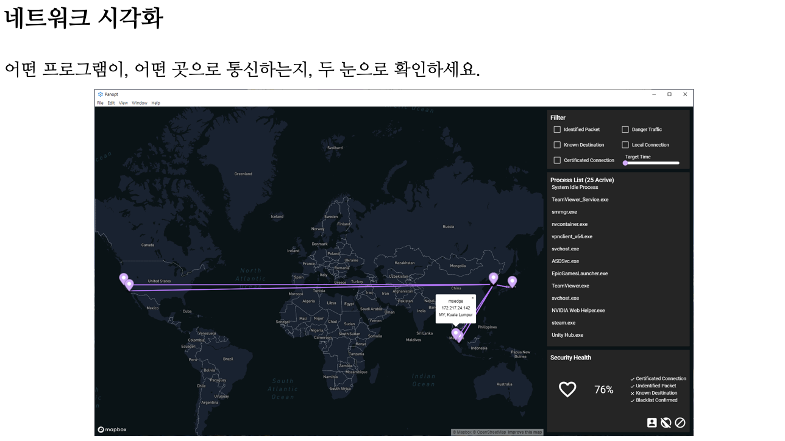
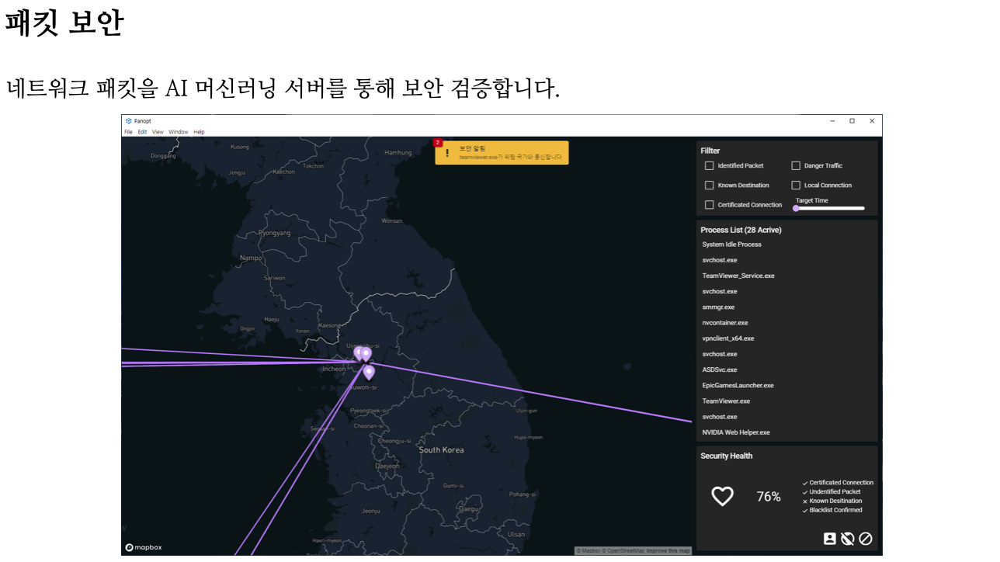
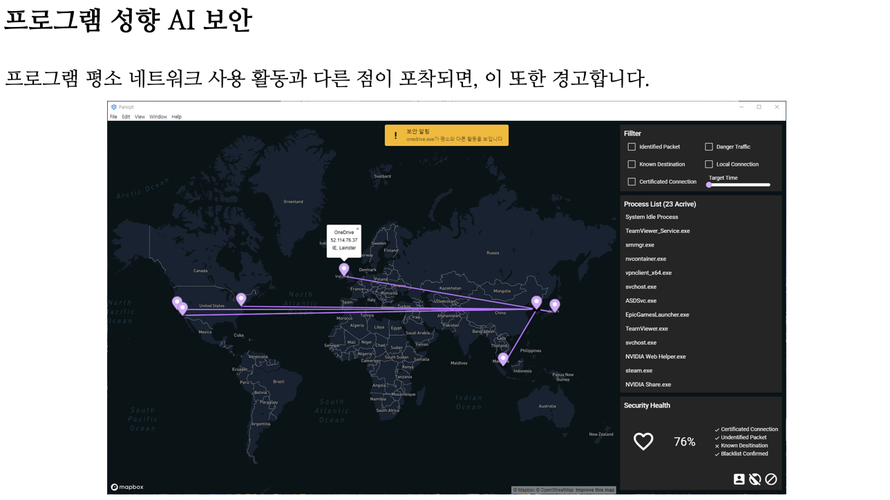
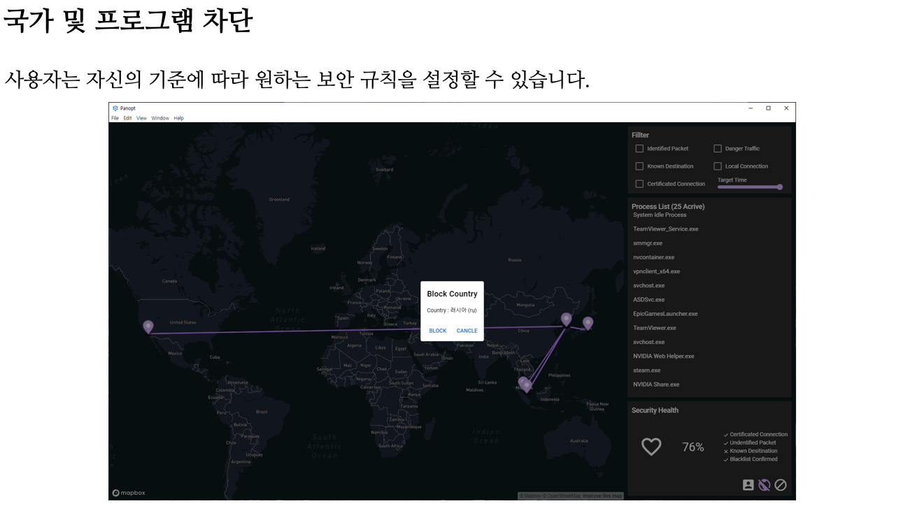

# Panopt Client

>AI를 사용한 PC 네트워크 감시 및 토폴로지 가시화 시스템 클라이언트 프로젝트

![version] ![license] ![lang] ![support]

Panopt는 시용자와 프로세스의 네트워크 사용 패턴을 통해 
대용량 트래픽에서 이상 여부를 탐지하는 AI 기반의 네트워크 이상 탐지 프로그램입니다. 
증가하는 네트워크 침해 사고에 대해 적은 비용과 높은 정확도로 위협을 탐지합니다. 

## Documents

System Architecture

## Screenshots

## Tech Stacks

Web Frontend
* [Vue.js](https://github.com/vuejs/vue)
* [Quasar Framework](https://quasar.dev/)
* [Electron](https://www.electronjs.org/)

Window Client
* [Python](https://www.python.org/)

## Participants

### [Moon Juhan](https://github.com/MoonJuhan)

Frontend Developer

### [Plumit](https://github.com/rct3232)

Window Client Developer

[version]: https://img.shields.io/badge/version-v1.0.0-blue
[support]: https://img.shields.io/badge/support-End-black
[license]: https://img.shields.io/github/license/Team-Pork-and-Rice-Soupp/angelhack-front
[lang]: https://img.shields.io/github/languages/top/develop-squad/panopt-client
